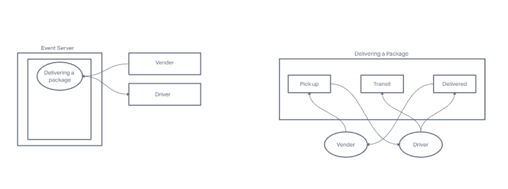

# LAB - 11

## Deployment Test

### Author: Allie Dunkel

- tests report
- front-end

#### Setup

.env requirements
  - PORT - Port Number

##### Running the app

- npm start
- Endpoint: /status
  - Returns Object

{

  "domain": 

  "status": "running",

  "port": 3001

}

##### Tests

Unit Tests: npm run test
Lint Tests: npm run lint

##### UML

